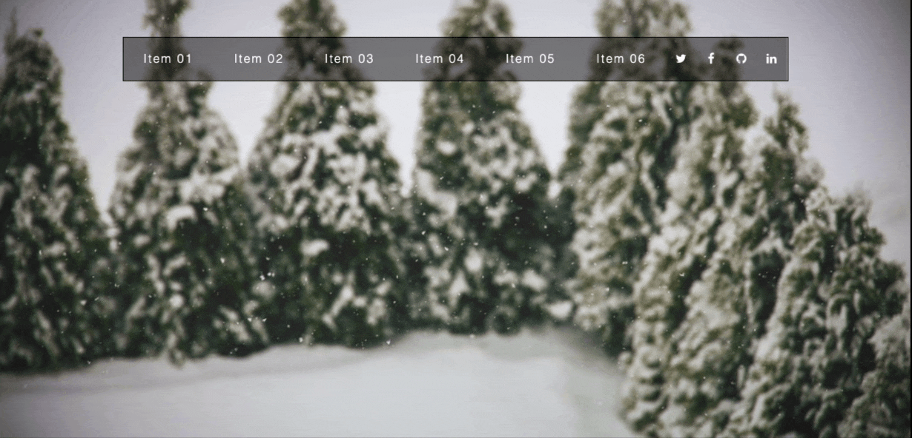
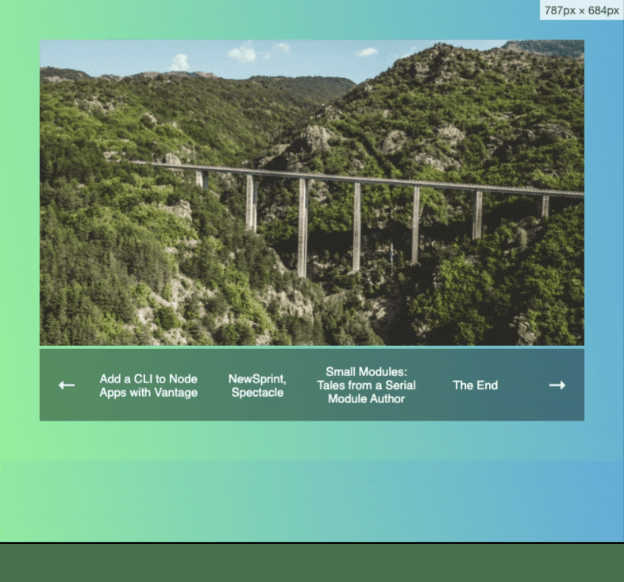
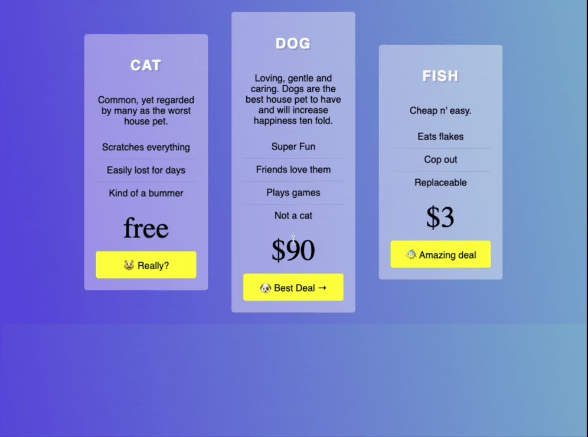

# What the Flexbox!

This is Css practice for [What the Flexbox Course](http://flexbox.io/) by Wes Bos , which i rebuild same projects that was performed in the course .

## 01 - FlexBox-Nav

## 02- Mobile-Reordering

## 03- Nesting-Flexbox

## 04- Pricing-Grid

| No.                 | Title             | Demo Link                                      | GitHub Link |
| ------------------- | ----------------- | ---------------------------------------------- | ----------- |
| #01                 | FlexBox-Nav       |  | [GitHub]()  |
| #02                 | Mobile-Reordering | [Demo]()                                       | [GitHub]()  |
| #03                 | Nesting-Flexbox   | [Demo]()                                       |
| [Demo]() [GitHub]() |
| #04                 | Pricing-Grid      | [Demo]()                                       | [GitHub]()  |
| #05                 | title 5           | [Demo]()                                       | [GitHub]()  |
| #05                 | title 6           | [Demo]()                                       | [GitHub]()  |
| #05                 | title 7           | [Demo]()                                       | [GitHub]()  |
